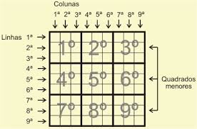

# Criando de um Jogo do sudoku em java

||
|:---:|  
||

## Regras básicas

- Grade: A grade principal tem \(9\) linhas e \(9\) colunas, formando \(81\) células no total. Ela é dividida em nove blocos menores de \(3\times 3\).
- Números: Você deve usar apenas os números de \(1\) a \(9\).
- Linhas, colunas e blocos: Cada linha, coluna e bloco \(3\times 3\) deve conter todos os números de \(1\) a \(9\).
- Sem repetições: Um mesmo número não pode aparecer mais de uma vez em uma mesma linha, coluna ou bloco.
- Objetivo: O jogo termina quando toda a grade está completamente preenchida, seguindo todas as regras.
